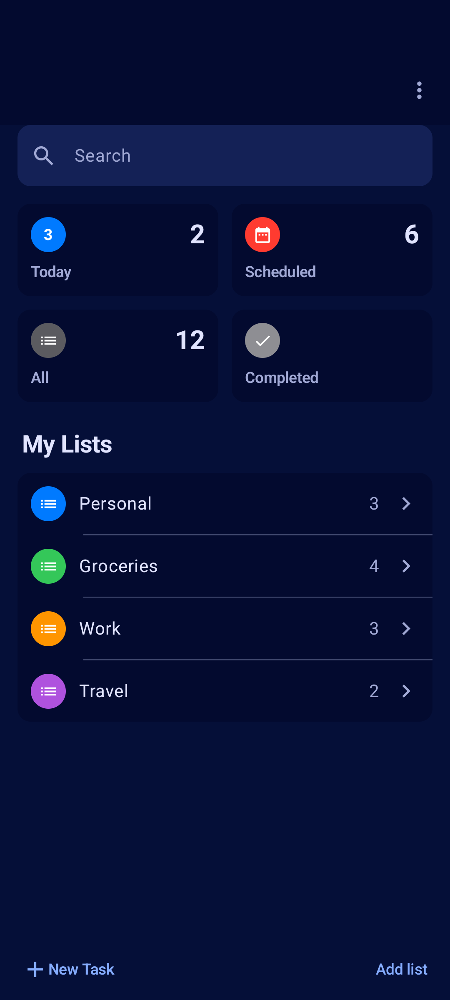
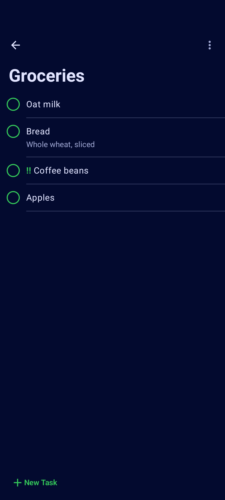
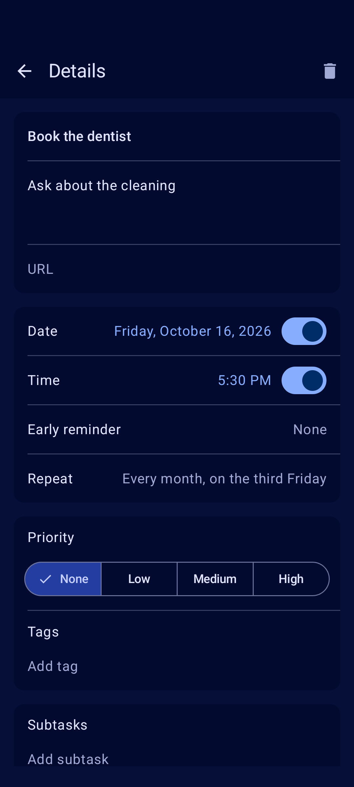

<!--
SPDX-FileCopyrightText: 2026 UltimateTasks contributors
SPDX-License-Identifier: GPL-3.0-or-later
-->

<div align="center">

# UltimateTasks

**Your Nextcloud tasks, the Apple Reminders way.**

[](https://github.com/qtekfun/UltimateTasks/actions/workflows/ci.yml)
[](LICENSE)
[](#requirements)

&nbsp;
&nbsp;


</div>

A friendly, offline-first Android app for the tasks you keep in [Nextcloud](https://nextcloud.com) (CalDAV), inspired by Apple Reminders: Today, Scheduled, All and Completed at a glance, your lists below, round checkboxes, repeating tasks, snoozing, and reminders that actually arrive, even on phones that like to kill apps in the background.

You choose which lists to show, so the task lists Nextcloud Deck publishes stay out of the way unless you want them.

Free software (GPL-3.0-or-later), with no Google services, no ads and no telemetry. Built for [F-Droid](https://f-droid.org).

## Features

- **Offline first**: lists and tasks live on the device; every change is saved at once and synced later through a queue that survives restarts. Properties the app does not edit are kept as the server sent them.
- **Smart lists**: Today, Scheduled, All and Completed, plus search across everything.
- **Your lists**: create, rename, recolor, pick an icon and reorder; deleting is off until you allow it in Settings. Hide the lists you do not want to see.
- **Tasks**: round checkboxes with undo, notes, due date and time, priority, tags, link, subtasks, move between lists, manual or sorted order. Share text from any app to add a task.
- **Repeating tasks**: daily, weekly, monthly, yearly or custom, including "the 3rd Friday of every month".
- **Reminders that arrive**: exact alarms, early reminders, snooze from the notification (15 min, 1 hour, tomorrow), an alarm-clock mode, and a wizard that walks you through the settings phones from Xiaomi, Oppo, Huawei, Samsung and others need.
- **Conflicts handled, never silently lost**: if a title or notes changed both here and on the server, you choose which to keep.
- **Settings**: light/dark/system theme, pure black, Material You colors, English and Spanish; export and restore them.
- **Tablets**: two or three panes on wide screens.
- **Secure**: HTTPS only, app password obtained through Nextcloud's Login Flow v2 and encrypted with the Android Keystore.

## Requirements

- Android 8.0 (API 26) or newer.
- A Nextcloud server with tasks in CalDAV (the Tasks app, Calendar or Deck).

## Building

The project uses Gradle with the version catalog in `gradle/libs.versions.toml`. Gradle needs JDK 21.

```sh
./gradlew assembleDebug              # debug APK
./gradlew check                      # what CI runs: unit tests, detekt, ktlint, Android Lint, Kover
./gradlew connectedDebugAndroidTest  # UI tests, on a connected device or emulator
```

Dependencies are verified (`gradle/verification-metadata.xml`) and their licenses checked: only free software is allowed.

## Privacy

UltimateTasks only talks to your own Nextcloud server. See [PRIVACY.md](PRIVACY.md) for what it stores and every permission it asks for, and why.

## Contributing

See [CONTRIBUTING.md](CONTRIBUTING.md). The specification is in [SPEC.md](SPEC.md) and the roadmap in [PLAN.md](PLAN.md).

## License

GPL-3.0-or-later. See [LICENSE](LICENSE).
